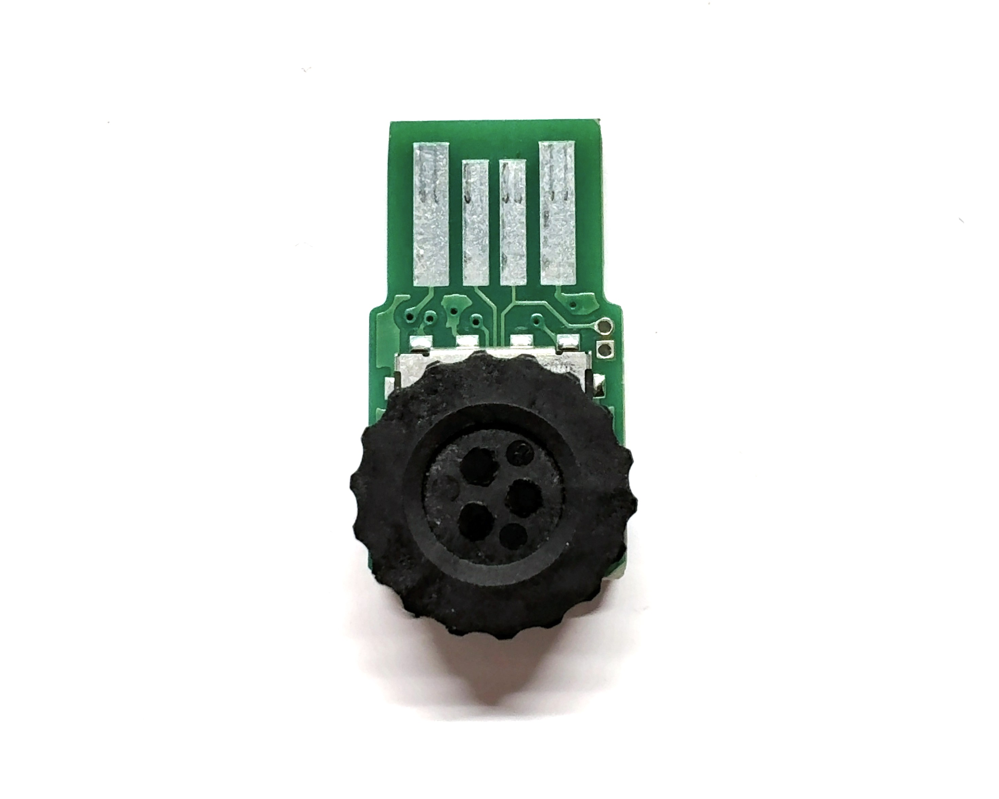
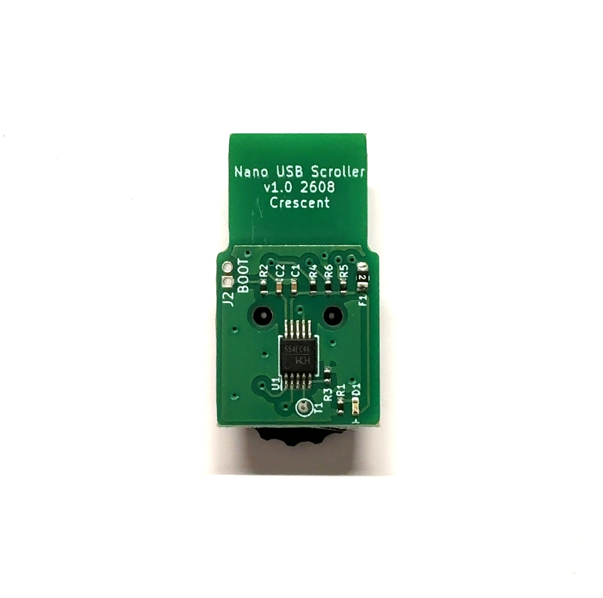

# Overview
  * This board is equipped with scroll and center button functions.  
  * It supports vertical scrolling and center button operation.  
  * Suitable for small PCs and SBCs(Single Board Computers, like Raspberry Pi).  
  * It operates using standard drivers, without the need for a dedicated driver.   
  * The vertical scrolling direction can be changed to match the USB orientation.  

# Direction Setting
  * To change the scroll direction, press and hold the center button while connecting the device to the USB port.  
  * The settings will be applied immediately.
  * If the settings are not applied, please perform the procedure again.  
  * The configuration data is automatically saved to flash memory.   
  * The orientation does not need to be set again for subsequent uses.  
  * The configuration data supports up to approximately 10,000 rewrite cycles.  
  * If you do not wish to change the orientation, connect this device to the USB port without pressing the center button.
  * To reverse the direction, perform the operation again to return it to the original state.

# Target user
  * It is ideal for users operating CAD software on a laptop.
  * It is convenient to use in combination with a [Nano USB mouse][1].  
    
# Note
  * Please take care not to short-circuit or damage components on the back of the board.    
  * Please operate gently. Operating it with excessive force may cause damage.  
  * PCB color, LED color, and other specifications are subject to change without notice.

## Appearance and examples

[1]: https://github.com/meerstern/Nano_USB_Mouse/
